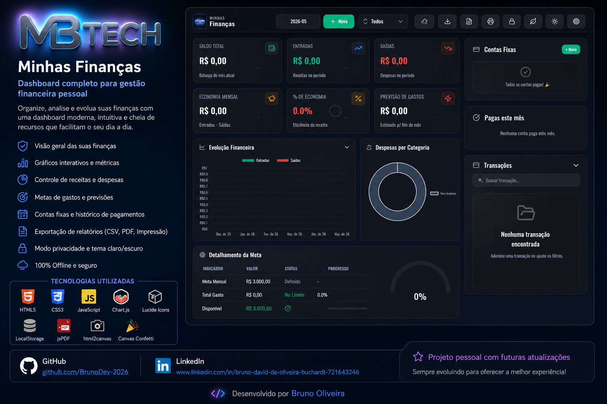

  

# MBTech Finanças 💰

O **MBTech Finanças** é uma aplicação de gestão financeira pessoal moderna, focada em uma experiência de usuário imersiva e funcional. O projeto utiliza uma estética *Cyberpunk* com *Glassmorphism*, oferecendo ferramentas avançadas para controle de receitas, despesas e metas.

## ✨ Funcionalidades Principais

- **Dashboard de Métricas**: Visualização de saldo, receitas, despesas e economia mensal com cards interativos e indicadores de tendência.
- **Modo Privacidade**: Permite ocultar valores sensíveis com um efeito de desfoque (*blur*), ideal para uso em locais públicos ou durante apresentações.
- **Modo Eco**: Otimização de performance que desativa animações pesadas e fundos dinâmicos para economizar bateria e recursos do sistema.
- **Sistema de Temas**: Suporte nativo para temas **Escuro** e **Claro**, com transições suaves e adaptação automática de todos os componentes.
- **Gestão de Metas**: Acompanhamento visual de objetivos financeiros com barras de progresso e gráficos de *gauge* customizados.
- **Interface Responsiva**: Design totalmente adaptável para dispositivos móveis, incluindo um botão flutuante (*FAB*) para novas transações em telas pequenas.
- **Estética Cyberpunk**: Experiência visual rica com efeitos de *scanlines*, fundo de estrelas dinâmico e animações de *glitch* na identidade visual.

## 🚀 Tecnologias Utilizadas

- **HTML5 & CSS3**: Estrutura semântica e estilização avançada utilizando Variáveis CSS e layouts em Grid/Flexbox.
- **Glassmorphism**: Efeitos de transparência modernos utilizando `backdrop-filter`.
- **Flatpickr**: Calendário customizado integrado ao design system para filtros de data precisos.
- **Lucide Icons**: Conjunto de ícones vetoriais elegantes e consistentes.

## 📂 Organização dos Estilos (CSS)

- `global.css`: Design system base, paleta de cores, tipografia, temas e animações globais.
- `components.css`: Estilização de botões, formulários, modais, toasts e inputs personalizados.
- `dashboard.css`: Layout do painel principal, cartões de métricas, lista de transações e seção de metas.

## 🛠️ Como Executar

### Pré-requisitos
- **Node.js** instalado
- **MongoDB** local (ou Atlas) rodando

### Passos
1. Clone o repositório.
2. Instale as dependências: `npm install`
3. Configure o arquivo `.env` com sua `MONGODB_URI` e `PORT`.
4. Inicie o servidor: `npm start`
5. Acesse no navegador: `http://localhost:3000`

## 🎨 Design System (Cores Principais)

| Elemento | Cor | Variável |
| :--- | :--- | :--- |
| **Positivo** | `#10B981` | `--color-positive` |
| **Despesa** | `#EF4444` | `--color-expense` |
| **Alerta** | `#F59E0B` | `--color-warning` |
| **Destaque** | `#E8C77A` | `--color-accent` |
| **Texto Principal** | `#F8FAFC` | `--text-main` |

---

## 🔗 Contato e Redes Sociais

Acompanhe meu trabalho e entre em contato:

---

*Desenvolvido com foco em UI/UX moderno e performance por Bruno David — MBTech.*
